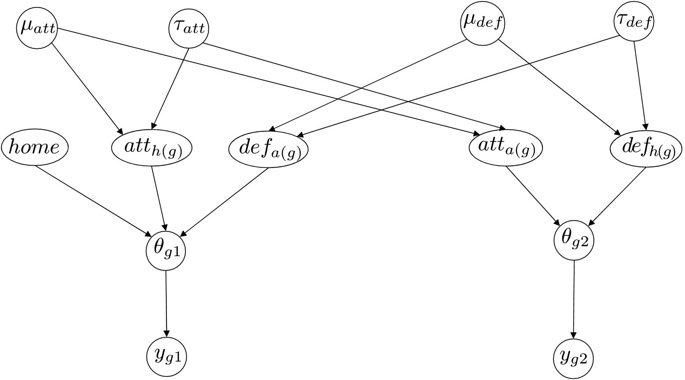

```{r, echo=TRUE, message = FALSE}
library(aaltobda)
library(rstan)
library(rstantools)
library(ggplot2)
library(loo)
df_res <- read.csv('ligue1-20192020-results.csv')
df_next <- read.csv('ligue1-20192020-cancelled-games.csv')
df_teams <- read.csv('ligue1-20192020-teams.csv')

options(mc.cores = parallel::detectCores())
rstan_options(auto_write = TRUE)
```
# 1. Introduction describing


In 2020, because of the COVID-19 outbrake, the football world has experienced one of the biggest economic crisis in its history and national championships all around Europe had to be interrupted for several weeks. In an economy that revolves mostly around Sports broadcasting contracts, match day revenues, and player sales, stop playing games for a long period of time is an unbearable situation. Most leagues in Europe started playing games without home and away fans, before and after their domestic lockdowns, despite the risks of contamination between the players. However, in some countries, such as France, Scotland and Belgium, national leagues had to be 'freezed' (=terminated) approximately 10 match days short compared to a regular season, not without controversy. Indeed, on top of the aforementioned economics impacts, a lot of football club representatives in those countries considered themselves wronged by this decision. Based on the following fixtures and momentum in the past few games, they felt like their team could have reached much more desirable spots in the league table (that would have allowed them to avoid relegation or to reach promotion and european competitions for instance) if they were allowed to play the remaining games. And because some teams would have arguably had easier fixtures coming up than others it is very difficult to deny those claims. In addition, there are usually a lot of surprises towards the end of a season because of the uncertain nature of the sport. In the French Ligue 1 for instance, 71% of the teams have changed places over the last 10 games of season historically.

Also in France, numerous alternatives were proposed by club owners to avoid 'freezing' the season, and even though they were not retained in the end, one did stand out from a scientific point of view... In an interview with the French media L'Equipe in april 2020, Lille president Gerard Lopez said 'We can imagine a more scientific calculation model in which we would simulate the results of the last ten games, according to the points taken at home or away this season, to obtain a ranking after 38 games'. Such models based on Bayesian theory not only exist, but are used by bookmakers to predict the outcomes of a season. But how reliable are they in reality? What kind of impact thoses predictions would have had on the final Ligue 1 table? Would Lopez's team have managed to secure a place in the Champions League at the expense of Rennes or Marseille in the remaining matches? We will try to answer those questions in this report by creating our own 2020 Ligue 1 simulation model.

But first, let's start introducing a little bit of abstraction to understand how we can predict the outcome of a football game. Unfortunately for us, there would never be a perfectly accurate answer to that question as football is such an unpredictable game. The sport itself is full of David vs Goliath stories and there would be so much parameters to took into account that it would not be a dead end to try reaching very high level accuracies for this project.
The approach we had was much simpler. Intuitively, we hypothesized that each team in France had some abilities to attack and defend that we would like to evaluate based on the previous results. Then, when looking at a fixture we could combine those values to know how much goals the home and away sides are likely to score or concede. We also added a some fixed bonus to the home side to represente the home advantage in football. Indeed, as they are playing in front of their own fans, it has been shown that home teams tend to win a little bit more frequently and we wanted to take this information into account as well. Knowing this information is particularly important in our case study because it enables us to simulate games were the home advantage's influence is removed (games that are played without public because of the COVID restrictions for instance).


# 2. Description of the data and the analysis problem. 

For this analysis, we have used scoresheets data allongside the composition of the remaining fixtures of the 2019-2020 Ligue 1 season from the internet website Soccerway.com.
Considering the fact that our research question is derived from a recent event at the time of writting, it is unlikely to our knowledge than other existing analysis have been made on the same dataset. However, it is worth to mention that our work takes inspiration from other academic works that have been performed on different leagues and seasons, works that are themselves based on decades of scientific research made on sports analytics and prediction models.


# 3. Description of the models

As we have said, our work took inspiration from other academic publications. In particular, "Bayesian hierarchical model for the prediction of football results" by Baio and Blangiardo has been an great source of knowledge and a corner stone for the models we have decided to implement. As its name suggest it, the paper uses a hierarchical model to predict the attacking and defensive strenght of the teams.

The hyperpriors define the mean and standard deviation of a team's capabibilities on both the attacking and defensive side:
$$
\mu_{att} \sim \text{Normal}(0, 100) \\
\tau_{att} \sim \text{Gamma}(0.1, 0.1) \\
\mu_{def} \sim \text{Normal}(0, 100) \\
\tau_{def} \sim \text{Gamma}(0.1, 0.1)
$$
Leading the following description of the team-specific effects (for each team $t$ in $1,...,T$) modelled as exchangeable from a common normal distribution:
$$
\text{att}_{t} \sim \text{Normal}(\mu_{att}, \tau_{att}) \\
\text{def}_{t} \sim \text{Normal}(\mu_{def}, \tau_{def}) \\
$$

The home advantage is modelled by a normal prior as well:
$$
\text{model} \sim \text{Normal}(0,100)
$$

Thus, the scoring rate $\theta$ for both team during the g-th game of the season is defined with a log-linear random effect model:
$$
\text{log}(\theta_{g,1}) = \text{home} + \text{att}_{h(g)} + \text{def}_{a(g)} \\
\text{log}(\theta_{g,2}) = \text{att}_{a(g)} + \text{def}_{h(g)}
$$
How should one understand this formula ? Well, notice in the second formula how the value of the scoring intensity of the away team $\theta_{g,2}$ is high if its attacking capability $\text{att}_{a(g)}$ is high or if the defensive capability of the home team $\text{def}_{h(g)}$ is high (defensive capabilities are always negative in this definition). Same thing could be said for the first formula but with the addition of the team advantage variable.

There is a small catch however. In order to achieve identifiability of the above model parameters and facilitate the interpretation the results in the end, we have to use a standard set of constraints on the $\text{att}$ and $\text{def}$ variables. The authors opted for a sum-to-zero constraint (which is simply equivalent to centering the variables $\text{att}$ and $\text{def}$):
$$
\sum_{t=1}^T \text{att}_{t} = 0 \\
\sum_{t=1}^T \text{def}_{t} = 0
$$

Finally, since the goals occurring in the game are rare events with now known rates $\theta_{g,1}$ and $\theta_{g,2}$, Poisson distributions are particularly suited to transform those rates in an actual number of goals for each side $y_{g,1}$ and $y_{g,2}$:
$$
y_{gj} | θ_{gj} \sim \text{Poisson}(θ_{gj}),
$$

In the end, the model can be sumarized by the following sketch that is featured in the paper:
```{r figurename, echo=FALSE, fig.cap="my caption", out.width = '50%'}

```


4. Informative or weakly informative priors, and justification of their choices.


# 5. Stan code (brms can be used to generate the code, but Stan code needs to be present and explained).


## Separate model


```{stan, output.var="separate_model", eval = FALSE}
data {
  int<lower=0> N;
  int<lower=0> nteams;
  int y1[N];
  int y2[N];
  int hometeam[N];
  int awayteam[N];
  
  int<lower=0> next_N;
  int next_hometeam[next_N];
  int next_awayteam[next_N];
}


parameters {
  //parameters
  real<lower=0> home;
  vector<lower=0>[nteams] att_star;
  vector<lower=0>[nteams] def_star;
}


transformed parameters{
  vector[nteams] att;
  vector[nteams] def;
  real<lower=0> lambda[N, 2];
  
  // center attacking and defending (sum to zero)
  for (t in 1:nteams){
    att[t] = att_star[t] - mean(att_star);
    def[t] = def_star[t] - mean(def_star);
  }
  
  for (g in 1:N){
    // Average Scoring intensities (accounting for mixing components)
    lambda[g,1] = exp(home + att[hometeam[g]] + def[awayteam[g]]);
    lambda[g,2] = exp(att[awayteam[g]] + def[hometeam[g]]);
  }
}


model {
  home ~ normal(0,100);
  
  for (t in 1:nteams){
    att_star[t] ~ normal(0, 1);
    def_star[t] ~ normal(0, 1);
  }
  
  for (g in 1:N) {
    // Observed number of goals scored by each team
    y1[g] ~ poisson(lambda[g,1]);
    y2[g] ~ poisson(lambda[g,2]);
  }
}


generated quantities {
  real<lower=0> next_lambda[next_N, 2];
  int next_y1[next_N];
  int next_y2[next_N];
  vector[N] log_lik[2];
  
  for (g in 1:next_N){
    // Average Scoring intensities (accounting for mixing components)
    next_lambda[g,1] = exp(att[next_hometeam[g]] + def[next_awayteam[g]]);
    next_lambda[g,2] = exp(att[next_awayteam[g]] + def[next_hometeam[g]]);
    
    // Predicted number of goals scored by each team
    next_y1[g] = poisson_rng(next_lambda[g,1]);
    next_y2[g] = poisson_rng(next_lambda[g,2]);
  }
  
   for (g in 1:N){
      log_lik[1,g] = poisson_lpmf(y1[g] | lambda[g,1]);
      log_lik[2,g] = poisson_lpmf(y2[g] | lambda[g,2]);
}
  
  
}

```

## Hierarchical model
```{stan, output.var="hierarchical_model", eval = FALSE}
data {
  int<lower=0> N;
  int<lower=0> nteams;
  int y1[N];
  int y2[N];
  int hometeam[N];
  int awayteam[N];
  
  int<lower=0> next_N;
  int next_hometeam[next_N];
  int next_awayteam[next_N];
}


parameters {
  //hyperparameters
  // real mu_att;
  real<lower=0> sigma_att;
  
  // real mu_def;
  real<lower=0> sigma_def;
  
  //parameters
  real<lower=0> home;
  
  vector<lower=0>[nteams] att_star;
  vector<lower=0>[nteams] def_star;
}


transformed parameters{
  vector[nteams] att;
  vector[nteams] def;
  real<lower=0> lambda[N, 2];
  
  // center attacking and defending (sum to zero)
  for (t in 1:nteams){
    att[t] = att_star[t] - mean(att_star);
    def[t] = def_star[t] - mean(def_star);
  }
  
  for (g in 1:N){
    // Average Scoring intensities (accounting for mixing components)
    lambda[g,1] = exp(home + att[hometeam[g]] + def[awayteam[g]]);
    lambda[g,2] = exp(att[awayteam[g]] + def[hometeam[g]]);
  }
}


model {
  home ~ normal(0,100);
  
  // mu_att ~ normal(0,100) T[0,];
  sigma_att ~ gamma(0.1,0.1);
  
  // mu_def ~ normal(0,100) T[0,];
  sigma_def ~ gamma(0.1,0.1);
  
  for (t in 1:nteams){
    att_star[t] ~ normal(0, sigma_att); //normal(mu_att, sigma_att) T[0,];
    def_star[t] ~ normal(0, sigma_def); //normal(mu_def, sigma_def) T[0,];
  }
  
  for (g in 1:N) {
    // Observed number of goals scored by each team
    y1[g] ~ poisson(lambda[g,1]);
    y2[g] ~ poisson(lambda[g,2]);
  }
}


generated quantities {
  real<lower=0> next_lambda[next_N, 2];
  int next_y1[next_N];
  int next_y2[next_N];
  vector[N] log_lik[2];
  
  for (g in 1:next_N){
    // Average Scoring intensities (accounting for mixing components)
    next_lambda[g,1] = exp(att[next_hometeam[g]] + def[next_awayteam[g]]);
    next_lambda[g,2] = exp(att[next_awayteam[g]] + def[next_hometeam[g]]);
    
    // Predicted number of goals scored by each team
    next_y1[g] = poisson_rng(next_lambda[g,1]);
    next_y2[g] = poisson_rng(next_lambda[g,2]);
  }
  
     for (g in 1:N){
      log_lik[1,g] = poisson_lpmf(y1[g] | lambda[g,1]);
      log_lik[2,g] = poisson_lpmf(y2[g] | lambda[g,2]);
}
}
```
6. How to the Stan model was run, that is, what options were used. This is also more clear as combination of textual explanation and the actual code line.

7. Convergence diagnostics (R, ESS, divergences) and what was done if the convergence was not good with the first try.
8. Posterior predictive checks and what was done to improve the model.

# 9. Model comparison (e.g. with LOO-CV).
Here we assess whether there are differences between the proposed models with regard to the $elpd_{loo-cv}$, and if so, which model should be selected according to PSIS-LOO.
Before we compare the difference in $elpd_{loo-cv}$, we have to make sure that all estimate are reliable. We can analyze these using the Pareto k diagnostic, which is intended to estimate how far an individual leave-one-out distribution is from the full distribution. The Pareto k estimate, in turn, is a diagnostic for Pareto smoothed importance sampling, which is used to approximate the leave-one pointwise predictive distribution for the leave one out cross validation. Data points with k-value greater than 0.7 are often the result of model misspecification and frequently correspond to data points that would be considered outliers. If $k>0.7$, it means leaving out an observation significantly changes the posterior and importance sampling fails to produce reliable estimate. If the $k<0.7$ we can consider the corresponding estimate with a relatively high accuracy. However, large k-values are a useful indicator of model misspecifications, small k-values are not a guarantee that model is well-specified. In case of proposed two models, the PSIS-LOO estimates both for separate and hierarchical models are reliable, and we can compare two models. When we compare models, we conclude that the difference in $elpd_{loo-cv}$ and its scale relative to the approximate standard error of the difference indicates a preference for the hierarchical model. 

```{r}
model_separate <- readRDS("separate_model.rds")
model_hierarchical <- readRDS("hierarchical_model.rds") 
```
Computing the PSIS-LOO elpd values and the k-values for separate model.
```{r}
log_lik_sep <- extract_log_lik(model_separate, merge_chains = FALSE)
r_eff_sep <- relative_eff(exp(log_lik_sep), cores = 2)
loo_sep <- loo(log_lik_sep, r_eff = r_eff_sep, cores = 2)
```

Visualization of k-values for separate model.
```{r}
plot(loo_sep,
     diagnostic = c("k", "n_eff"),
     label_points = FALSE,
     main = "PSIS diagnostic plot separate model"
)
```
PSIS-LOO values for separate model.
```{r}
loo_sep
```


Computing the PSIS-LOO elpd values and the k-values for hierarchical model.
```{r}
log_lik_hierarchical <- extract_log_lik(model_hierarchical,
                                        merge_chains = FALSE)
r_eff_hierarchical <- relative_eff(exp(log_lik_hierarchical), cores = 2)
loo_hierarchical <- loo(log_lik_hierarchical, r_eff = r_eff_hierarchical, 
                        cores = 2)
```
Visualization of k-values for hierarchical model.
```{r}
plot(loo_hierarchical,
     diagnostic = c("k", "n_eff"),
     label_points = FALSE,
     main = "PSIS diagnostic plot hierarchical model")
```
PSIS-LOO values for hierarchical model.
```{r}
loo_hierarchical
```


Comparing the models on expected log predictive density
```{r}
loo_compare(loo_sep, loo_hierarchical)
```


10. Predictive performance assessment if applicable (e.g. classification accuracy) and evaluation of practical usefulness of the accuracy.

11. Sensitivity analysis with respect to prior choices (i.e. checking whether the result changes a lot if prior is changed)
12. Discussion of issues and potential improvements.
13. Conclusion what was learned from the data analysis.
14. Self-reflection of what the group learned while making the project.

